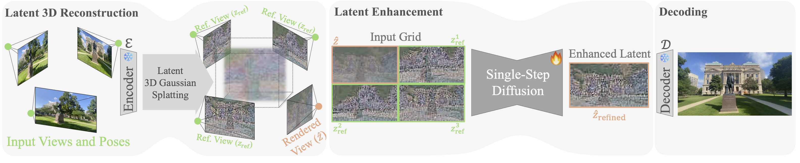

# Splatent: Reference-based Diffusion Enhancement for 3D Gaussian Splatting [CVPR 2026]

A PyTorch implementation of a reference-based diffusion model for enhancing latent features in 3D Gaussian Splatting novel view synthesis.

## Overview

Splatent enhances novel view synthesis by leveraging Stable Diffusion Turbo that operates on latent features from 3D Gaussian Splatting. The model uses reference views with grid attention to improve the quality of synthesized images.



## Quick Start with Unified Pipeline

For complete pipeline (train GS → render → create dataset → inference Splatent code):

```bash
python unified_pipeline.py \
  --scene_path /path/to/scene \
  --output_dir ./results \
  [--save_images\]
```

**Note:** This assumes a pre-trained Splatent model is available at `ckpt/ckpt.pkl`. You can set another path using `--model_splatent_path` parameter. We provide pre-trained model weights [here](https://huggingface.co/orhir/Splatent/tree/main).

## Installation

```bash
conda env create -f environment.yml
conda activate splatent
pip install --no-build-isolation submodules/feature-3dgs/submodules/custom_rasterizer
pip install --no-build-isolation submodules/feature-3dgs/submodules/simple-knn
```

## Training Pipeline Stages

### 1. Extract Features from Images

Extract SD-Turbo VAE latent features from RGB images for a single scene:

```bash
python scripts/extract_features.py \
  --input /path/to/scene \
  --output features_sd_turbo \
  --res images_4 \
  --device cuda
```

**Arguments:**
- `--input`: Path to scene directory
- `--output`: Output directory name for features (default: `features_sd_turbo`)
- `--res`: Input images directory name (default: `images_4`)
- `--device`: Device to use (default: `cuda`)

**Expected directory structure:**
```
scene/
├── images_4/          # Input RGB images (or custom via --res)
│   ├── 00001.png
│   └── ...
└── features_sd_turbo/ # Output features (auto-created)
    ├── 00001.pt
    └── ...
```

### 2. Train Feature-3DGS

Train 3D Gaussian Splatting with the extracted features using [feature-3dgs](https://github.com/ShijieZhou-UCLA/feature-3dgs):

```bash
cd submodules/feature-3dgs
python train.py -s /path/to/scene -m /path/to/output -i images_4
```

Then render novel view features from the trained model:

```bash
python render.py -m /path/to/trained/model
```

This creates the required directory structure with `nvs/`, `nvs_gt/`, and `train_gt/` subdirectories.

### 3. Generate Dataset JSON

Create dataset JSON from rendered 3DGS features with camera-aware reference selection:

```bash
python scripts/generate_dataset.py \
  --out_path /path/to/rendered/features \
  --original_path /path/to/original/dataset \
  --output data/dataset.json \
  --top_k 3
```

**Arguments:**
- `--out_path`: Directory containing rendered features (with `nvs/`, `nvs_gt/`, `train_gt/` subdirs per scene)
- `--original_path`: Original dataset with camera poses (`transforms.json` or COLMAP format)
- `--output`: Output JSON file path
- `--top_k`: Number of closest reference views (default: 3)
- `--benchmark`: Generate benchmark dataset (all test, no train split)
- `--llff`: Use COLMAP format instead of transforms.json

**Note:** This step requires features rendered from a trained feature-3dgs model, not the raw extracted features from step 1.

### 4. Train Splatent Model

Train the enhancement model on extracted features:

```bash
python -m accelerate.commands.launch \
  --mixed_precision=bf16 \
  --main_process_port 29501 \
  --multi_gpu \
  --num_machines 1 \
  --num_processes [NUM_GPUS] \
  src/train.py \
  --dataset_path [PATH_TO_DATA_JSON] \
  --max_train_steps 15000 \
  --resolution 512 \
  --learning_rate 2e-5 \
  --train_batch_size 1 \
  --dataloader_num_workers 16 \
  --enable_xformers_memory_efficient_attention \
  --checkpointing_steps 1000 \
  --eval_freq 1000 \
  --viz_freq 100 \
  --logger tensorboard \
  --tracker_project_name splatent \
  --lambda_l2 1.0 \
  --lambda_lpips 2.0 \
  --scale \
  --output_dir outputs/splatent \
  --tracker_run_name [RUN_NAME] \
  --timestep 300 \
  --top_k 3
```

### Custom Inference

For inference on custom images:

```bash
python src/inference_custom.py \
  --input_image /path/to/input \
  --ref_image /path/to/reference \
  --prompt "A photo of a scene" \
  --model_path /path/to/checkpoint.pkl \
  --output_dir ./results
```

## Pretrained Models

Download pretrained Splatent checkpoint:
- **Model**: [splatent_checkpoint.pkl](https://huggingface.co/orhir/Splatent/tree/main)
- Trained on SD-Turbo VAE latent features
- Supports 3 reference views with grid attention

## Dataset Format

The dataset JSON should have the following structure:

```json
{
  "train": {
    "feature_id_1": {
      "feature": "/path/to/features/scene1/frame001.pt",
      "target_feature": "/path/to/features/scene1/frame002.pt",
      "ref_features": [
        "/path/to/features/scene1/frame003.pt",
        "/path/to/features/scene1/frame004.pt",
        "/path/to/features/scene1/frame005.pt"
      ],
      "prompt": "A photo of a scene"
    }
  },
  "test": { ... }
}
```

### RGB Image Paths (For training)

**Option 1: Co-located with features (default)**
- Feature: `/path/to/features/scene1/frame001.pt`
- Image: `/path/to/features/scene1/frame001.png`

**Option 2: Separate RGB directory (using `--rgb_root`)**
- Feature: `/path/to/features/scene1/train/frame001.pt`
- Image: `/path/to/rgb_images/scene1/images_4/frame001.png`

The `--rgb_root` parameter allows you to specify a separate directory for RGB images while maintaining the scene name and filename structure.

## Citation

If you use this code in your research, please cite:

```bibtex
@article{splatent2025,
      title={Splatent: Splatting Diffusion Latents for Novel View Synthesis}, 
      author={Or Hirschorn and Omer Sela and Inbar Huberman-Spiegelglas and Netalee Efrat and Eli Alshan and Ianir Ideses and Frederic Devernay and Yochai Zvik and Lior Fritz},
      year={2025},
      eprint={2512.09923},
      archivePrefix={arXiv},
      primaryClass={cs.CV},
      url={https://arxiv.org/abs/2512.09923}, 
}
```

## License

See [LICENSE](LICENSE.txt) for details.
Additionaly - [Stable Diffusion license](https://huggingface.co/stabilityai/sd-turbo/blob/main/LICENSE.md).

## Acknowledgments
We thank the excelent repos of [Stable Diffusion](https://github.com/Stability-AI/stablediffusion),  [Diffusers](https://github.com/huggingface/diffusers), [Diffix3d+](https://github.com/nv-tlabs/Difix3D), [Feature 3DGS](https://github.com/ShijieZhou-UCLA/feature-3dgs), [3D Gaussian Splatting](https://github.com/graphdeco-inria/gaussian-splatting), [LPIPS](https://github.com/richzhang/PerceptualSimilarity)